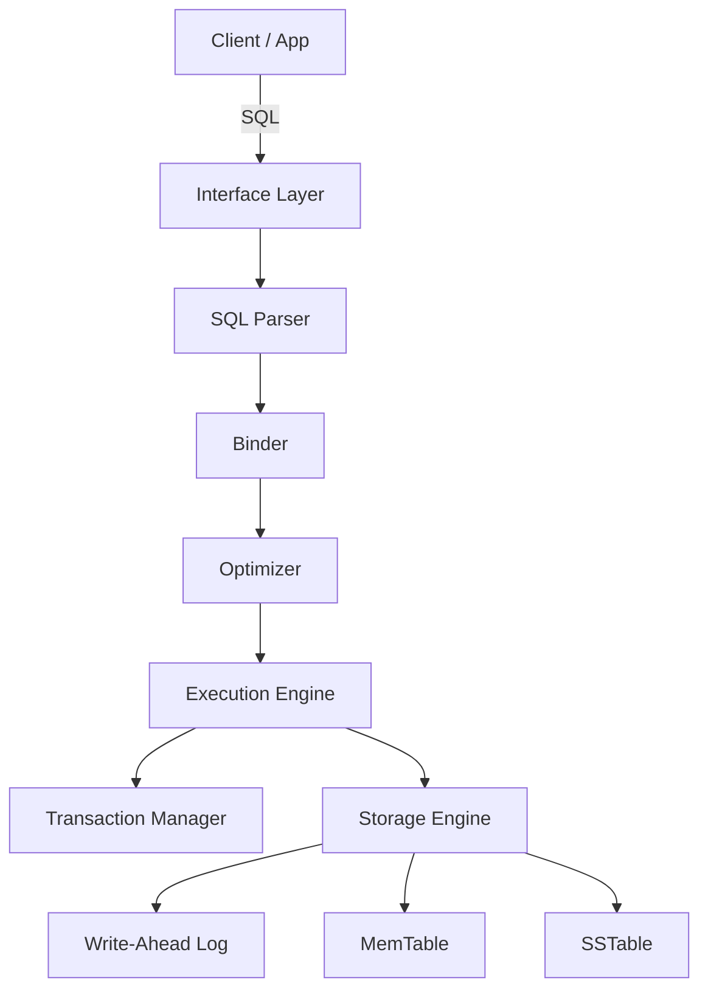

# MiniDB Architecture

MiniDB is a transactional, SQL-compliant database engine designed for educational purposes. It implements a single-process, embeddable database that persists data to disk using an **LSM Tree (Log-Structured Merge Tree)** storage engine and guarantees ACID properties through **Write-Ahead Logging (WAL)** and **Multi-Version Concurrency Control (MVCC)**.

## High-Level Design

The architecture follows a modular, layered approach typical of relational database systems. Data flows from the client interfaces through the SQL engine, execution layer, and finally to the storage engine.



## Component Layers

### 1. Interface Layer
*   **REPL (`cmd/minidb`)**: A robust interactive command-line shell for direct SQL execution.
*   **TCP Server (`internal/server`)**: A network listener (default port 3000) accepting newline-delimited SQL commands, enabling remote connectivity.

### 2. SQL Layer (`internal/sql`)
*   **Parser**: A custom recursive-descent parser that converts SQL strings into an Abstract Syntax Tree (AST). It supports `SELECT`, `INSERT`, and specific clauses like `WHERE`.
*   **Binder**: Resolves table and column names against the system Catalog. It transforms the AST into a type-safe logical plan (e.g., `SeqScanNode`, `IndexScanNode`).
*   **Optimizer**: Performs simple heuristic optimizations, such as selecting an Index Scan over a Sequential Scan when a suitable index key is present in the `WHERE` clause.

### 3. Execution Layer (`internal/executor`)
*   **Volcano Iterator Model**: The execution engine uses a pipelined iterator model where each operator implements an `Open`-`Next`-`Close` interface.
*   **Operators**:
    *   `SeqScan`: Full table scan.
    *   `IndexScan`: O(1) primary key lookup.
    *   `Filter`: Applied predicate filtering.
    *   `Insert`: Writes tuples to storage.
    *   `Project` (Implicit): Selects specific columns.

### 4. Transaction Layer (`internal/txn`)
*   **Transaction Manager**: Orchestrates transaction lifecycles (`Begin`, `Commit`, `Abort`) and maintains the state of active transactions.
*   **MVCC**: Implements Snapshot Isolation. Every tuple is versioned with `Xmin` (creator) and `Xmax` (deleter) transaction IDs. Visibility checks ensure that readers only see effective data snapshots consistent with their start time.

### 5. Storage Layer (`internal/storage`)
*   **LSM Tree Implementation**:
    *   **MemTable**: In-memory mutable structure (sorted map) buffering recent writes.
    *   **SSTable**: Immutable, sorted on-disk files for older data.
    *   **WAL (`internal/wal`)**: Append-only log ensuring durability. All writes are logged before being applied to memory.
*   **Compaction**: Background process that merges multiple SSTables into a single file, reclaiming space and optimizing read paths.
*   **Indexing**: Hash Index support for fast primary key lookups.

## Package Layout

The codebase is organized into clean, responsibility-driven packages:

```
minidb/
├── cmd/
│   └── minidb/         # Application entrypoint (main.go)
├── internal/
│   ├── catalog/        # Schema definition and metadata
│   ├── executor/       # Query execution operators
│   ├── integration/    # End-to-end integration tests
│   ├── server/         # TCP server implementation
│   ├── sql/
│   │   ├── binder/     # Semantic analysis and binding
│   │   ├── parser/     # API for SQL parsing
│   │   └── plan/       # Logical query plans
│   ├── storage/        # LSM Tree, MemTable, SSTable
│   │   └── index/      # Indexing structures
│   ├── txn/            # Transaction management (MVCC)
│   └── wal/            # Write-Ahead Logging
├── pkg/
│   └── types/          # Shared types (Tuple, Schema, Errors)
├── docs/               # Detailed documentation
└── tests/              # Additional test suites
```

## Key Design Principles

1.  **Modularity**: Strict separation between Parsing, Planning, and Execution allows for independent testing and future extensibility (e.g., swapping the storage engine).
2.  **Concurrency**: The use of MVCC allows readers to proceed without blocking writers, suitable for mixed read/write workloads.
3.  **Durability**: The Write-Ahead Log is the source of truth for crash recovery, ensuring ACID compliance.
4.  **Simplicity**: The codebase prioritizes readability and educational value, avoiding over-optimization in favor of clear, demonstrable concepts.
