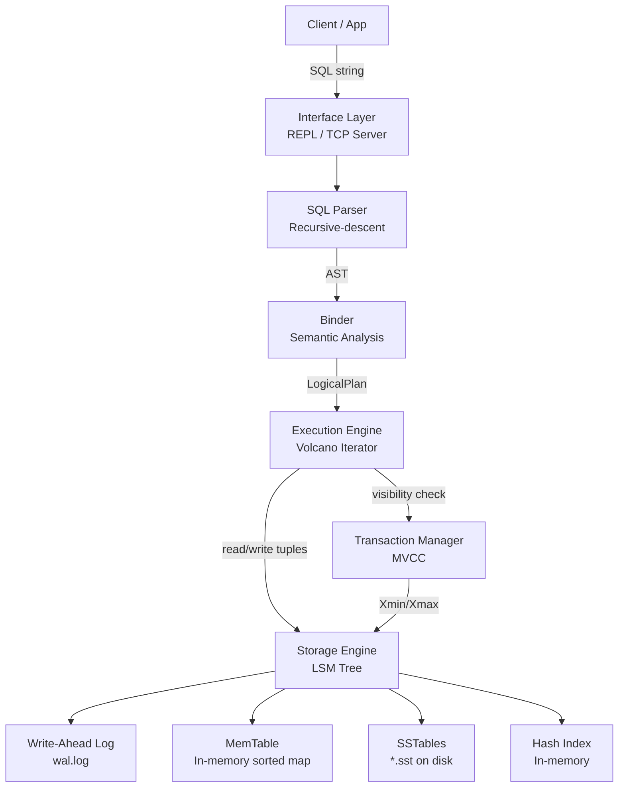

# MiniDB Architecture

MiniDB is a transactional, SQL-compliant relational database engine written in Go, designed for educational purposes. It implements a single-process, embeddable database that persists data to disk using an **LSM Tree (Log-Structured Merge Tree)** storage engine and guarantees ACID properties through **Write-Ahead Logging (WAL)** and **Multi-Version Concurrency Control (MVCC)**.

---

## Table of Contents

1. [High-Level Design](#high-level-design)
2. [File Structure](#file-structure)
3. [Component Layers](#component-layers)
4. [Data Flows](#data-flows)
5. [Happy Paths](#happy-paths)
6. [Transaction Lifecycle](#transaction-lifecycle)
7. [Storage Internals](#storage-internals)
8. [Key Algorithms & Data Structures](#key-algorithms--data-structures)
9. [System Startup & Initialization](#system-startup--initialization)
10. [Error Handling & Recovery](#error-handling--recovery)
11. [Testing Strategy](#testing-strategy)
12. [Design Decisions & Trade-offs](#design-decisions--trade-offs)

---

## High-Level Design

MiniDB follows a classic layered database architecture. A SQL command enters at the top and descends through discrete layers — each responsible for a single concern — before data is read from or written to disk.

```
┌─────────────────────────────────────────────────────┐
│                  Client Interface                    │
│            REPL  │  TCP Server (port 3000)           │
└──────────────────┬──────────────────────────────────┘
                   │ SQL string
┌──────────────────▼──────────────────────────────────┐
│                   SQL Layer                          │
│   Parser (AST)  →  Binder  →  Logical Plan           │
└──────────────────┬──────────────────────────────────┘
                   │ LogicalPlan
┌──────────────────▼──────────────────────────────────┐
│               Execution Layer                        │
│   Volcano Iterator Model (Open → Next → Close)       │
│   SeqScan │ IndexScan │ Filter │ Insert              │
└────────┬─────────────────────────┬──────────────────┘
         │ reads/writes            │ txn visibility
┌────────▼──────────┐   ┌──────────▼──────────────────┐
│  Storage Engine   │   │   Transaction Manager        │
│  LSM Tree         │   │   MVCC (Xmin/Xmax)           │
│  MemTable         │   │   Snapshot Isolation         │
│  SSTable files    │   └─────────────────────────────┘
│  Hash Index       │
└────────┬──────────┘
         │ durability
┌────────▼──────────┐
│  Write-Ahead Log  │
│  wal.log          │
└───────────────────┘
```



---

## File Structure

```
mini_db/
│
├── cmd/
│   └── minidb/
│       └── main.go              # Entry point: flag parsing, component wiring, REPL loop
│
├── internal/
│   ├── catalog/
│   │   └── catalog.go           # Schema registry: table definitions, column metadata
│   │
│   ├── executor/
│   │   ├── executor.go          # Executor interface (Open/Next/Close), ExecContext
│   │   ├── seqscan.go           # Full-table scan operator via MergeIterator
│   │   ├── indexscan.go         # Index-based point lookup operator
│   │   ├── filter.go            # Predicate evaluation operator (equality)
│   │   └── insert.go            # Tuple insertion operator (WAL + MemTable + Index)
│   │
│   ├── integration/
│   │   └── integration_test.go  # End-to-end tests: insert → select → compact → scan
│   │
│   ├── server/
│   │   └── server.go            # TCP server: accept conns, dispatch SQL commands
│   │
│   ├── sql/
│   │   ├── parser/
│   │   │   ├── parser.go        # Recursive-descent SQL parser → AST
│   │   │   ├── ast.go           # AST node definitions (SelectStmt, InsertStmt, etc.)
│   │   │   └── parser_test.go   # Parser unit tests
│   │   ├── binder/
│   │   │   ├── binder.go        # Resolves names → logical plan nodes
│   │   │   └── binder_test.go   # Binder unit tests
│   │   └── plan/
│   │       └── plan.go          # LogicalPlan interface + concrete node types
│   │
│   ├── storage/
│   │   ├── engine.go            # LSMEngine: InsertTuple, GetTuple, ScanTable, Flush, Compact
│   │   ├── memtable.go          # MemTable: in-memory sorted map with snapshot iterator
│   │   ├── sstable.go           # SSTable: binary on-disk KV format, reader, writer
│   │   ├── storage_test.go      # Storage layer unit tests
│   │   └── index/
│   │       └── hash_index.go    # HashIndex: key → []PKs, equality lookups only
│   │
│   ├── txn/
│   │   ├── txn.go               # TxnManager: Begin/Commit/Abort, visibility rules
│   │   └── txn_test.go          # MVCC visibility unit tests
│   │
│   └── wal/
│       ├── wal.go               # WAL: append-only log, LSN tracking, replay
│       └── wal_test.go          # WAL unit tests
│
├── pkg/
│   └── types/
│       └── types.go             # Core shared types: Tuple, Schema, Column, Value, errors
│
├── docs/
│   ├── architecture.md          # Component-level documentation
│   ├── storage.md               # LSM Tree, compaction mechanics
│   ├── transactions.md          # MVCC implementation details
│   ├── sql.md                   # SQL parsing and execution flow
│   └── usage.md                 # Build, run, and persistence guide
│
├── architecture.md              # This document
├── README.md                    # Project overview
├── Makefile                     # Build targets: build, run, server, test, clean
├── go.mod                       # Module: minidb, Go 1.25+
└── go.sum                       # Dependency checksums
```

### Data Directory (runtime-generated)

```
data/                            # Created at startup relative to CWD
├── wal.log                      # Append-only write-ahead log
├── <timestamp>.sst              # Flushed SSTable files
└── compacted_<timestamp>.sst    # Post-compaction merged SSTable
```

---

## Component Layers

### 1. Interface Layer

The interface layer is the entry point for all user interaction. It owns the session state (active transaction ID) and dispatches commands to the SQL engine.

#### REPL (`cmd/minidb/main.go`)

- Reads SQL from `stdin` line-by-line via `bufio.Scanner`
- Maintains session state: `currentTxnID`, `inTransaction` flag
- Handles meta-commands directly (no parsing needed):
  - `BEGIN` → `txnMgr.BeginTxn()`
  - `COMMIT` → `txnMgr.CommitTxn(id)`
  - `ROLLBACK` → `txnMgr.AbortTxn(id)`
  - `FLUSH` → `engine.Flush()`
  - `COMPACT` → `engine.Compact()`
  - `HELP`, `SHOW TABLES`, `DESCRIBE <table>` → catalog queries
- Auto-wraps SQL DML in a transaction when none is active (implicit transactions)
- Formats and prints results to `stdout`

#### TCP Server (`internal/server/server.go`)

- Listens on configurable port (default `3000`)
- Accepts multiple concurrent client connections (one goroutine per connection)
- Protocol: newline-delimited SQL commands, newline-delimited responses
- Each connection shares the same engine/catalog instances (no per-connection state beyond a buffer)
- Delegates command execution to the same handler function used by the REPL

---

### 2. SQL Layer (`internal/sql`)

The SQL layer transforms a raw SQL string into a typed, validated logical plan.

#### Parser (`internal/sql/parser/`)

- **Algorithm**: Recursive-descent, hand-written (no parser generator)
- **Input**: Raw SQL string
- **Output**: AST node (`SelectStmt` or `InsertStmt`)
- **Supported syntax**:
  ```sql
  SELECT col1, col2 FROM table [WHERE col = value]
  SELECT *       FROM table [WHERE col = value]
  INSERT INTO table (col1, col2) VALUES (val1, val2)
  ```
- **AST nodes** (`ast.go`):
  - `SelectStmt` — columns, table name, optional `WhereClause`
  - `InsertStmt` — table name, column list, value list
  - `WhereClause` — column name, operator, literal value
- **Tokenization**: inline, character-by-character with keyword recognition
- **Error handling**: returns descriptive parse errors for unexpected tokens

#### Binder (`internal/sql/binder/`)

- **Input**: AST node + Catalog reference
- **Output**: `LogicalPlan` node tree
- **Responsibilities**:
  1. Validate table existence against Catalog
  2. Resolve column names to column indices
  3. Select scan strategy:
     - If `WHERE` column has a `HashIndex` → emit `IndexScanNode`
     - Otherwise → emit `SeqScanNode` wrapped in `FilterNode`
  4. Propagate schema information into plan nodes
- **Binder does not execute** — it only builds the plan

#### Logical Plan (`internal/sql/plan/`)

- **Interface**: `LogicalPlan` with `Schema()` and `Children()` methods
- **Concrete nodes**:
  - `SeqScanNode` — full scan of a table
  - `IndexScanNode` — lookup via index with a predicate value
  - `FilterNode` — wraps a scan node, applies a predicate
  - `InsertNode` — insert a row with specific column/value pairs
- Plans are trees; children are sub-plans fed into parent operators

---

### 3. Execution Layer (`internal/executor`)

Implements the **Volcano Iterator Model** (also called the Pipeline model). Each operator is a node that produces tuples on demand.

#### Operator Interface (`executor.go`)

```go
type Executor interface {
    Open(ctx ExecContext) error   // Initialize state, open children
    Next() (*types.Tuple, error)  // Return next matching tuple, nil = EOF
    Close() error                 // Release resources
}
```

`ExecContext` carries:
- `Engine` — the LSM storage engine
- `TxnID` — current transaction ID for visibility filtering
- `Catalog` — schema metadata

#### Operators

| Operator | File | Description |
|----------|------|-------------|
| `SeqScanExec` | `seqscan.go` | Opens a `MergeIterator` over MemTable + all SSTables. Calls `TxnIterator` for MVCC-filtered iteration. |
| `IndexScanExec` | `indexscan.go` | Calls `index.Get(value)` → `[]PKs`, then fetches each tuple with `engine.GetTuple(pk, txnID)`. |
| `FilterExec` | `filter.go` | Wraps another executor. Pulls tuples from child, evaluates predicate, returns only matches. |
| `InsertExec` | `insert.go` | Calls `engine.InsertTuple(tuple, txnID)`. Sets `Xmin=txnID`, `Xmax=0`. |

#### Execution Flow

```
LogicalPlan
    │
    ▼  (physical operator built from plan node)
Executor.Open(ctx)
    │
    loop:
    ▼
Executor.Next()   ──→  nil (EOF)
    │
    ▼ tuple
Consumer (REPL/Server prints result)
    │
    ▼
Executor.Close()
```

---

### 4. Transaction Layer (`internal/txn`)

Implements **Multi-Version Concurrency Control (MVCC)** with Snapshot Isolation.

#### TxnManager (`txn.go`)

- Maintains a map of `TxnID → TxnState` (Active, Committed, Aborted)
- Issues monotonically increasing 64-bit transaction IDs
- Operations:
  - `BeginTxn()` → new TxnID, state = Active
  - `CommitTxn(id)` → state = Committed
  - `AbortTxn(id)` → state = Aborted

#### MVCC Tuple Versioning

Every stored tuple carries two metadata fields:

| Field | Type | Meaning |
|-------|------|---------|
| `Xmin` | uint64 | TxnID that created this version |
| `Xmax` | uint64 | TxnID that deleted this version (0 = alive) |

#### Visibility Rules

For transaction `T` reading a tuple:

```
IsVisible(tuple, T) =
  Xmin == T                          → visible (own insert, not yet committed)
  OR
  (
    state[Xmin] == Committed         → creator committed
    AND
    (Xmax == 0 OR state[Xmax] != Committed)  → not deleted (or deleter uncommitted)
  )
```

This gives **Snapshot Isolation**: each transaction sees a consistent snapshot of committed data as of its start time.

#### Isolation Guarantees

| Anomaly | MiniDB Behavior |
|---------|----------------|
| Dirty Reads | Prevented — only committed Xmin visible |
| Non-Repeatable Reads | Prevented — snapshot is fixed at BeginTxn |
| Phantom Reads | Partially prevented — range scans use same snapshot |
| Lost Updates | Not fully prevented — no lock-based write conflict detection |

---

### 5. Storage Layer (`internal/storage`)

Implements a **Log-Structured Merge Tree (LSM Tree)** optimized for write-heavy workloads.

#### LSMEngine (`engine.go`)

The central storage coordinator. Holds references to:
- `MemTable` (active write buffer)
- `[]*SSTable` (on-disk immutable files, ordered newest-first)
- `WAL` (durability log)
- `map[string]*index.HashIndex` (one per indexed column)

Key operations:

| Method | Description |
|--------|-------------|
| `InsertTuple(tuple, txnID)` | WAL append → MemTable set → index update |
| `GetTuple(pk, txnID)` | MemTable lookup → SSTable scan (newest first) → visibility check |
| `ScanTable(txnID)` | Returns MVCC-filtered `MergeIterator` |
| `Flush()` | Writes MemTable to a new `.sst` file, clears MemTable |
| `Compact()` | Merges all SSTables → single compacted file |

#### MemTable (`memtable.go`)

- Structure: sorted in-memory map (Go `map` + sorted key list)
- Supports: `Set(key, value)`, `Get(key)`, `Scan()` (sorted iteration)
- Thread-safe: `sync.RWMutex` guards all access
- On `Flush()`: serialized to SSTable format via `SSTableWriter`

#### SSTable (`sstable.go`)

Binary on-disk format:

```
┌──────────────────────────────────────────────┐
│  Entry 1: [KeyLen:4][Key:n][ValLen:4][Val:m] │
│  Entry 2: [KeyLen:4][Key:n][ValLen:4][Val:m] │
│  ...                                          │
│  (entries in sorted key order)               │
└──────────────────────────────────────────────┘
```

- Written by `SSTableWriter`: sequential appends, then close
- Read by `SSTableReader`: sequential scan (no random access / B-Tree index)
- Values are serialized `types.Tuple` structs (via `encoding/gob`)
- Filename: `<unix-timestamp-ns>.sst`

#### MergeIterator

Merges results from MemTable and all SSTables:
- Returns entries in sorted key order across all sources
- Deduplicates: returns the newest version of a key (MemTable wins over SSTables)
- Used by `SeqScanExec` and `Compact()`

#### TxnIterator

Wraps `MergeIterator` with MVCC visibility filtering:
- Calls `txnMgr.IsVisible(tuple, txnID)` on each candidate
- Skips invisible tuples (uncommitted inserts, committed deletes)

#### Hash Index (`index/hash_index.go`)

```
HashIndex {
  index: map[string][]string   // value → list of primary keys
}
```

- `Put(value, pk)` — adds a PK to the value's bucket
- `Get(value)` → `[]string` — returns all PKs matching the value
- Updated synchronously during `InsertTuple`
- In-memory only (rebuilt from WAL on recovery — not yet implemented)
- Supports equality lookups only (no range queries)

#### Compaction

```
All SSTables (newest first)
    │
    ▼ MergeIterator
Deduplicate: keep only newest version per key
    │
    ▼ SSTableWriter
compacted_<timestamp>.sst
    │
Replace old SSTables with compacted file
```

- Reduces read amplification (fewer files to scan)
- Reclaims disk space (removes overwritten versions)
- Triggered manually (`COMPACT` command) — no automatic threshold yet

---

## Data Flows

### Write Path (INSERT)

```
User: INSERT INTO users (id, name) VALUES (1, 'alice')
                │
                ▼
    ┌─────────────────────┐
    │   Parser            │  → InsertStmt{table:"users", cols:[id,name], vals:[1,"alice"]}
    └──────────┬──────────┘
               │
    ┌──────────▼──────────┐
    │   Binder            │  → InsertNode{table, cols, vals} (validates against catalog)
    └──────────┬──────────┘
               │
    ┌──────────▼──────────┐
    │   InsertExec        │  → calls engine.InsertTuple(tuple{Xmin=txnID, Xmax=0}, txnID)
    └──────────┬──────────┘
               │
    ┌──────────▼──────────┐
    │   LSMEngine         │
    │   1. WAL.Append()   │  → durable log entry written to wal.log
    │   2. MemTable.Set() │  → key="1", value=tuple stored in memory
    │   3. Index.Put()    │  → hashIndex["id"]["1"] = ["1"]
    └─────────────────────┘
```

### Read Path (SELECT with index)

```
User: SELECT * FROM users WHERE id = 1
                │
                ▼
    ┌─────────────────────┐
    │   Parser            │  → SelectStmt{cols:*, table:"users", where:{id=1}}
    └──────────┬──────────┘
               │
    ┌──────────▼──────────┐
    │   Binder            │  → IndexScanNode{table, index:"id", value:"1"}
    └──────────┬──────────┘         (index exists for "id" column)
               │
    ┌──────────▼──────────┐
    │   IndexScanExec     │
    │   1. index.Get("1") │  → [pk="1"]
    │   2. engine.GetTuple│  → raw tuple from MemTable or SSTables
    │   3. IsVisible()?   │  → yes (Xmin committed, Xmax=0)
    └──────────┬──────────┘
               │
    Result: [{id:1, name:"alice"}]
```

### Read Path (SELECT with full scan)

```
User: SELECT * FROM users WHERE name = 'alice'
                │
                ▼
    ┌─────────────────────┐
    │   Binder            │  → SeqScanNode wrapped in FilterNode{name="alice"}
    └──────────┬──────────┘         (no index on "name")
               │
    ┌──────────▼──────────┐
    │   FilterExec        │
    │   wraps SeqScanExec │
    └──────────┬──────────┘
               │
    ┌──────────▼──────────┐
    │   SeqScanExec       │
    │   MergeIterator     │  → merges MemTable + all SSTables in key order
    │   TxnIterator       │  → filters by IsVisible(tuple, txnID)
    └──────────┬──────────┘
               │
    FilterExec pulls tuples, applies (name == "alice") predicate
               │
    Result: [{id:1, name:"alice"}]
```

### Flush Path

```
FLUSH command
    │
    ▼
LSMEngine.Flush()
    │
    ├─ SSTableWriter.Open("<timestamp>.sst")
    │
    ├─ MemTable.Scan() → iterate all key-value pairs
    │
    ├─ For each entry: SSTableWriter.Write(key, tuple_bytes)
    │
    ├─ SSTableWriter.Close()
    │
    ├─ Append new SSTable to engine.sstables[]
    │
    └─ MemTable.Clear()
```

### Compaction Path

```
COMPACT command
    │
    ▼
LSMEngine.Compact()
    │
    ├─ MergeIterator(all SSTables, newest first)
    │
    ├─ SSTableWriter.Open("compacted_<timestamp>.sst")
    │
    ├─ For each unique key (newest version only): Write to new SSTable
    │
    ├─ SSTableWriter.Close()
    │
    ├─ Close & delete old SSTable files
    │
    └─ engine.sstables = [compacted SSTable]
```

---

## Happy Paths

### Happy Path 1: Single Insert + Select (REPL, implicit transaction)

```
1. User types:  INSERT INTO users (id, name) VALUES (1, 'alice')

2. REPL detects no active transaction → calls txnMgr.BeginTxn() → txnID=1

3. Parser → InsertStmt
4. Binder → InsertNode
5. InsertExec.Open(ctx{engine, txnID=1})
6. InsertExec.Next():
   a. Builds Tuple{Values:[1,"alice"], Xmin:1, Xmax:0}
   b. engine.InsertTuple(tuple, 1)
      i.  WAL.Append(tuple)       → persisted to wal.log
      ii. MemTable.Set("1", tuple)
      iii.hashIndex.Put("1", "1")
   c. Returns tuple (insert successful)

7. REPL auto-commits → txnMgr.CommitTxn(1) → state[1]=Committed

8. Output: "1 row inserted"

9. User types:  SELECT * FROM users WHERE id = 1

10. REPL begins new implicit txn → txnID=2

11. Parser → SelectStmt
12. Binder → IndexScanNode (id has HashIndex)
13. IndexScanExec.Open(ctx{engine, txnID=2})
14. IndexScanExec.Next():
    a. hashIndex.Get("1") → ["1"]
    b. engine.GetTuple("1", txnID=2)
       i.  MemTable lookup → Tuple{Xmin:1, Xmax:0}
    c. txnMgr.IsVisible(tuple, 2):
       - state[Xmin=1] == Committed ✓
       - Xmax == 0 ✓
       → visible
    d. Returns Tuple

15. REPL auto-commits → txnMgr.CommitTxn(2)
16. Output: "id=1, name=alice"
```

### Happy Path 2: Explicit Transaction with Multiple Inserts

```
BEGIN
  → txnMgr.BeginTxn() → txnID=3

INSERT INTO users (id, name) VALUES (2, 'bob')
  → InsertExec → engine.InsertTuple(Tuple{Xmin:3}, engine)

INSERT INTO users (id, name) VALUES (3, 'carol')
  → InsertExec → engine.InsertTuple(Tuple{Xmin:3}, engine)

SELECT * FROM users
  → SeqScanExec → MergeIterator → TxnIterator(txnID=3)
  → Both rows visible (Xmin=3, state[3]=Active, own inserts)

COMMIT
  → txnMgr.CommitTxn(3) → state[3]=Committed
  → Both rows now visible to all future transactions
```

### Happy Path 3: Flush + Compact Maintenance

```
(after many inserts)

FLUSH
  → engine.Flush()
  → MemTable → written to "1700000000.sst"
  → MemTable cleared (reads now hit SSTable)

COMPACT
  → engine.Compact()
  → MergeIterator over all SSTables
  → Single "compacted_1700000001.sst" produced
  → Old SSTables removed
  → Read path now scans 1 file instead of N
```

---

## Transaction Lifecycle

```
           ┌─────────────┐
           │   BEGIN      │ ← txnMgr.BeginTxn() → new TxnID
           └──────┬───────┘
                  │ state = Active
       ┌──────────▼────────────┐
       │   Execute SQL ops      │ ← INSERT/SELECT with txnID
       │   (reads see snapshot) │
       └──────────┬────────────┘
                  │
        ┌─────────┴──────────┐
        │                    │
   ┌────▼────┐         ┌─────▼──────┐
   │ COMMIT  │         │  ROLLBACK  │
   └────┬────┘         └─────┬──────┘
        │ state=Committed    │ state=Aborted
        │                    │
        ▼                    ▼
  Xmin tuples          Xmin tuples
  visible to           invisible to
  future txns          all (orphaned
                       in MemTable,
                       GC'd on compaction)
```

**Implicit vs Explicit Transactions:**
- **Explicit**: User issues `BEGIN` / `COMMIT` / `ROLLBACK`
- **Implicit**: REPL auto-wraps each DML statement in `BeginTxn` + `CommitTxn`

---

## Storage Internals

### LSM Tree Read Amplification

On a `ScanTable` or `GetTuple`:

```
Check MemTable  →  hit? return
                →  miss? check SSTable[0] (newest)
                         →  miss? check SSTable[1]
                                  →  miss? ... SSTable[N]
                                             →  miss? key not found
```

Worst case: O(N) SSTable files scanned. Compaction reduces N back to 1.

### Write Path Through Storage

```
InsertTuple(tuple, txnID)
    │
    ├─ 1. WAL.Append(tuple)
    │      ├─ Serialize tuple to bytes
    │      ├─ Write [len:4][bytes:n] to wal.log (append-only)
    │      └─ Sync to disk (fdatasync)
    │
    ├─ 2. MemTable.Set(primaryKey, tuple)
    │      └─ mu.Lock(); map[key] = tuple; mu.Unlock()
    │
    └─ 3. For each indexed column:
           index.Put(columnValue, primaryKey)
```

### SSTable Binary Format Detail

```
File: <timestamp>.sst

[Entry 0]
  Offset 0:  KeyLen   (4 bytes, big-endian uint32)
  Offset 4:  Key      (KeyLen bytes, UTF-8 string)
  Offset 4+n: ValLen  (4 bytes, big-endian uint32)
  Offset 8+n: Value   (ValLen bytes, gob-encoded types.Tuple)

[Entry 1]
  ... (same format, keys in ascending sorted order)
```

---

## Key Algorithms & Data Structures

| Component | Algorithm / Structure | Complexity | Notes |
|-----------|----------------------|------------|-------|
| SQL Parser | Recursive-descent | O(n) tokens | Hand-written, no generator |
| Binder optimization | Index selection heuristic | O(1) | Checks if WHERE col has index |
| MemTable insert | HashMap set | O(1) amortized | Protected by RWMutex |
| MemTable scan | Sorted key iteration | O(k log k) | k = number of keys |
| SSTable write | Sequential append | O(n) | Write-once, immutable after |
| SSTable read | Sequential scan | O(n) | No B-Tree; full file scan |
| MergeIterator | K-way sorted merge | O(n log k) | n=total entries, k=num files |
| Hash Index lookup | HashMap get | O(1) average | Equality only, no range |
| MVCC visibility | State map lookup | O(1) | Per-tuple Xmin/Xmax check |
| Compaction | Merge + deduplicate | O(n log k) | Reduces k to 1 |
| WAL append | Sequential file write | O(1) amortized | Append-only, no seek |

---

## System Startup & Initialization

`cmd/minidb/main.go` wires all components in dependency order:

```
main()
  │
  ├─ 1. Parse flags: -server (bool), -port (int, default 3000)
  │
  ├─ 2. os.MkdirAll("data/", 0755)
  │
  ├─ 3. wal, err := wal.NewWAL("data/wal.log")
  │         └─ Opens/creates wal.log in append mode
  │
  ├─ 4. txnMgr := txn.NewTxnManager()
  │         └─ Initializes ID counter, state map
  │
  ├─ 5. engine, err := storage.NewLSMEngine("data/", wal, txnMgr)
  │         ├─ Loads existing *.sst files from data/ directory
  │         └─ Initializes empty MemTable
  │
  ├─ 6. catalog := catalog.NewCatalog()
  │
  ├─ 7. Hardcode schema:
  │         catalog.CreateTable("users", Schema{
  │             Columns: [{Name:"id", Type:Int}, {Name:"name", Type:String}]
  │         })
  │
  ├─ 8. idIndex := index.NewHashIndex()
  │         engine.AddIndex("users", "id", idIndex)
  │
  ├─ 9. if -server flag:
  │         server.New(engine, txnMgr, catalog).Run(port)
  │         └─ Blocks on net.Listen + Accept loop
  │
  └─ 10. else:
              runREPL(engine, txnMgr, catalog)
              └─ Blocks on stdin read loop
```

---

## Error Handling & Recovery

### WAL-based Crash Recovery

On startup, `NewLSMEngine` should replay the WAL to reconstruct MemTable state. The WAL provides:
- **Durability**: Every write is persisted before acknowledged
- **Atomicity**: Uncommitted transactions' WAL entries can be ignored on replay
- **Recovery**: Sequential replay rebuilds exact pre-crash state

*Note: Full WAL replay on startup is currently a planned improvement — the WAL is written but replay logic is not yet wired into the startup sequence.*

### Error Propagation Pattern

```go
// All operations return (result, error)
tuple, err := engine.GetTuple(pk, txnID)
if err != nil {
    return nil, fmt.Errorf("get tuple: %w", err)
}
```

- Parse errors → user-facing descriptive messages
- Storage errors → propagated up, REPL prints to stderr
- Transaction conflicts → caller responsibility to retry or abort

---

## Testing Strategy

### Test Coverage by Layer

| Layer | Test File | Scope | Key Scenarios |
|-------|-----------|-------|---------------|
| Parser | `parser/parser_test.go` | Unit | Valid SQL, error cases, WHERE clauses |
| Binder | `binder/binder_test.go` | Unit | Plan selection, missing table errors |
| Transaction | `txn/txn_test.go` | Unit | Visibility rules for all state combos |
| WAL | `wal/wal_test.go` | Unit | Append, read-back, persistence |
| Storage | `storage/storage_test.go` | Unit | MemTable ops, SSTable R/W, Flush, Scan |
| End-to-End | `integration/integration_test.go` | Integration | Full pipeline: insert→select→flush→compact |

### Testing Philosophy

- **Real implementations**: no mocking; uses real temp files, real memory structures
- **Isolation**: each test creates its own temp directory (`t.TempDir()`)
- **Sequential**: tests within a layer are independent and can run in any order
- **No parallelism issues**: single-threaded test execution per package

---

## Design Decisions & Trade-offs

| Decision | Rationale | Trade-off |
|----------|-----------|-----------|
| LSM Tree over B-Tree | Write-optimized; simpler implementation | Higher read amplification without compaction |
| MVCC over locking | Lock-free reads; good concurrency | No write-write conflict detection (lost updates possible) |
| Recursive-descent parser | No dependencies; easy to extend | Limited SQL syntax support |
| Sequential SSTable scans | Simple implementation | O(n) reads vs O(log n) with index |
| Hash index only | O(1) equality; simple code | No range queries, no ORDER BY optimization |
| Synchronous WAL writes | Durability guarantee | Lower write throughput vs async |
| No DDL at runtime | Simplicity | Schema must be hardcoded in main.go |
| Manual compaction | Explicit control for education | Production DBs auto-trigger on threshold |
| Single MemTable | Simple; no concurrent flush issues | Writes stall during flush |
| Go stdlib only | No external dependencies for core | Reimplements some wheel (e.g., serialization) |

---

## Workflows

### Developer Workflow

```
# Build
make build          → compiles to ./minidb binary

# Run interactively
make run            → starts REPL mode

# Run as server
make server         → starts TCP server on :3000

# Connect to server
nc localhost 3000
> INSERT INTO users (id, name) VALUES (1, 'alice')
> SELECT * FROM users

# Run all tests
make test

# Clean build artifacts and data
make clean          → removes ./minidb binary + ./data/
make reset          → removes ./data/ only (keep binary)
```

### REPL Command Reference

```
BEGIN               Start explicit transaction
COMMIT              Commit current transaction
ROLLBACK            Abort current transaction
FLUSH               Write MemTable to SSTable on disk
COMPACT             Merge all SSTables into one
HELP                Show available commands
SHOW TABLES         List all tables in catalog
DESCRIBE <table>    Show table schema (columns + types)

INSERT INTO <table> (<cols>) VALUES (<vals>)
SELECT <cols>|* FROM <table> [WHERE <col> = <val>]
```
